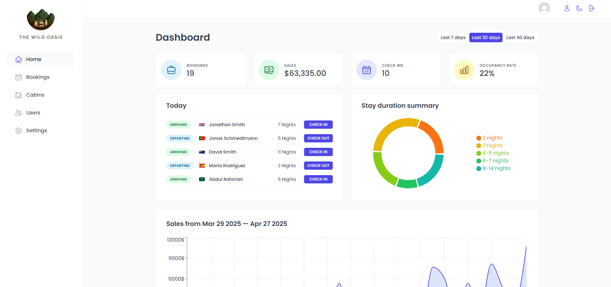
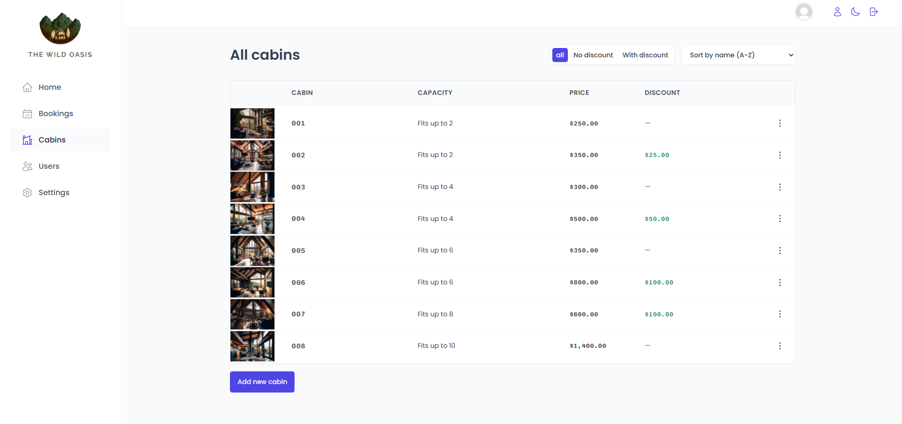
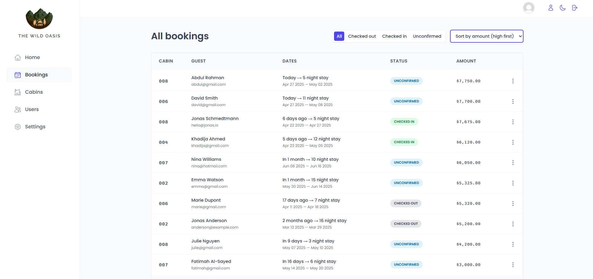

# The Wild Oasis

Welcome to **The Wild Oasis** – a modern hotel management platform tailored for hotel employees to manage cabins, bookings, and guests efficiently.  
Built with **React**, **Supabase**, and a range of modern tools, this application is designed for seamless, real-time operations directly from the hotel lobby.

---

## ✨ Live Demo

👉 [Coming soon!]()

---

## 🏨 About the Project

**The Wild Oasis** was built to streamline hotel operations for staff, not guests.  
Employees can manage everything from bookings to cabin details, monitor payments, and handle guest services like breakfast orders — all from one central application.

Because this app is designed for **internal use only**, it's optimized for desktop usage and runs on a dedicated computer in the lobby (no mobile support needed).

Only authenticated employees can access the system, and only authorized staff can create new accounts for other team members — ensuring full control and security.

---

## 📸 Screenshots

|                  Dashboard Overview                   |                      Manage Cabins                       |                   Guest Bookings                    |
| :---------------------------------------------------: | :------------------------------------------------------: | :-------------------------------------------------: |
|  |  |  |

---

## 🛠️ Features

- **Secure Authentication**  
  Login system ensuring only employees can access the app.

- **Cabin Management**  
  Create, edit, and delete cabins available for guests.

- **Booking Management**  
  View and update bookings, handle check-ins, check-outs, payments, and breakfast service.

- **Profile Management**  
  Employees can update their password, profile picture, and other account details.

- **Real-Time Data Updates**  
  Live updates for cabins and bookings using Supabase's real-time capabilities.

- **Statistics & Insights**  
  Dynamic charts displaying occupancy rates, sales figures, and operational KPIs.

- **Dark Mode**  
  Fully functional dark/light mode toggle for a personalized UI experience.

- **Role-Based Access**  
  New employee accounts can only be created by existing authenticated users.

---

## ⚙️ Tech Stack

| Frontend |          Backend & Database           |                 Other Tools                  |
| :------: | :-----------------------------------: | :------------------------------------------: |
|  React   | Supabase (Postgres + Auth + Realtime) | React Query, React Router, Styled Components |
|   Vite   |           Supabase Storage            |          React Hook Form, Recharts           |

---

## 🚀 What I Learned

Building **The Wild Oasis** was a deep dive into several real-world, advanced concepts, including:

- **Authentication & Authorization** with Supabase
- **Real-time Functionality** for bookings and cabin management
- **Efficient State Management** with React Query
- **Reusable UI Patterns** such as Compound Components and Higher-Order Components (HOCs)
- **Theme Support** with dark mode integration
- **Data Visualization** using Recharts for clear operational insights
- **Responsive and Maintainable Codebase** using modern React best practices

---

## 🧰 Getting Started

Follow these steps to set up the project locally:

1. **Clone the repository**

   ```bash
   git clone https://github.com/Joel-Persson1/the-wild-oasis.git
   ```

2. **Install dependencies**

   ```bash
   npm install
   ```

3. **Run the development server**
   ```bash
   npm run dev
   ```

---

## 🙏 Special Thanks

This project was developed as part of the <a href="https://codingheroes.io/" target="_blank">Jonas Schmedtmann</a> Udemy course.  
Special thanks to Jonas for his excellent teaching and for providing deep, practical insights into building fullstack React applications!

---

## 🎯 Why This Project?

As a developer, I’m passionate about building real-world solutions that solve genuine problems.  
**The Wild Oasis** was the perfect opportunity to combine **frontend precision**, **backend logic**, and **user experience** design into one unified application.

This project strengthened my skills in:

- Building scalable and maintainable codebases
- Implementing secure authentication and authorization flows
- Managing real-time data updates effectively
- Designing intuitive and efficient UIs for internal business tools
- Thinking about scalability, security, and usability from a real-world perspective
